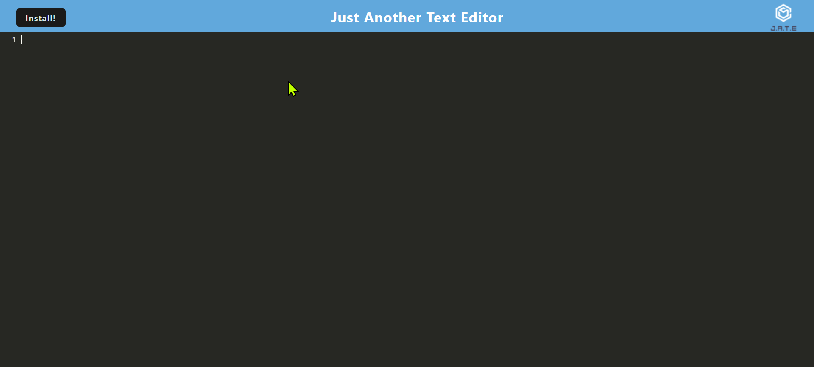

# Text-Editor
Progressive Web Applications (PWA)

## Description

This is a Progressive Web Application (PWA) developed to utilize Webpack, Service Worker, and a Manifest file to provide an enhanced user experience, including offline accessibility.

## Features

1. **Offline Support:** The application can be accessed and used even without an active internet connection, thanks to the implementation of a Service Worker.

2. **Localized Experience:** The application can be installed on your device, providing a native-like experience.

3. **Stored Processes (Caching):** The Service Worker caches the application's assets, enhancing its speed.

4. **Manifest:** The Manifest file defines the application's metadata, allowing it to be installed across an array of devices.

## Installation

To view this project, it requires a browser to be installed on your preferred device. The browser can be any one of your choosing. To view, enter the following URL to the address bar of said browser:

https://text-editor-tlc-e60a5fee4c44.herokuapp.com/

## Usage

When viewing the website, it should resemble the following image. Included is a screenshot of how it should look in your desired web browser. If you have any issues viewing, please contact me via email at TinaTheDev91@gmail.com.

## Credits and Mentions

Thank you to my instructor Suarav for teaching us PWA fundamentals.

## Resources

This project referenced much of the code used for the Module 19 - Mini Project which was included in our study materials.
